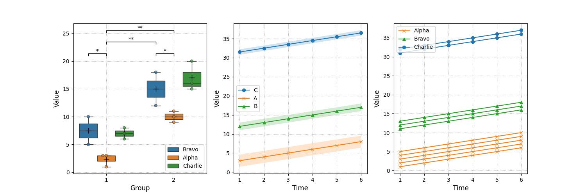

# trplots

* `trplots`(trend plots)はデータ傾向把握に役立つグラフを生成するためのPythonパッケージ
* 以下のグラフを生成可能: 各グラフの詳細は[使用方法](#使用方法)を参照
    * 箱ひげ図 (外れ値を除いた平均値, 有意差を表すブラケット, データの分布を確かめるJitter plotを追加可能)
    * 系列グラフ (入力データの平均値と標準偏差の網掛けを表示するもの)
        * 個別系列グラフ (入力の個別のデータを表示するもの: 系列グラフの詳細確認用)

## インストール

事前にgitがインストールされている必要がある.
以下はsshでのインストール方法

```bash
pip install git@github.com:sakashita44/trplots.git
```

## 依存パッケージ

* matplotlib
* seaborn
* pandas

## 使用方法

### 例:TrendPlotsクラスを使用してグラフを生成する

```python
import pandas as pd
import matplotlib.pyplot as plt
import trplots as trp

# サンプルデータの作成
data = pd.DataFrame({
    "group": [1, 1, 1, 1, 1, 1, 1, 1, 2, 2, 2, 2, 2, 2, 2, 2],
    "category": ["A","A","A","B","B","C","C","C","A","A","A","B","B","C","C","C",],
    "value": [1, 3, 3, 10, 5, 6, 7, 8, 9, 10, 11, 12, 18, 20, 15, 16]
})

line_data = pd.DataFrame(columns=["A", "A", "A", "A", "A", "B", "B", "B", "C", "C"])
line_data.loc["1"] = [1, 2, 3, 4, 5, 11, 12, 13, 31, 32]
line_data.loc["2"] = [2, 3, 4, 5, 6, 12, 13, 14, 32, 33]
line_data.loc["3"] = [3, 4, 5, 6, 7, 13, 14, 15, 33, 34]
line_data.loc["4"] = [4, 5, 6, 7, 8, 14, 15, 16, 34, 35]
line_data.loc["5"] = [5, 6, 7, 8, 9, 15, 16, 17, 35, 36]
line_data.loc["6"] = [6, 7, 8, 9, 10, 16, 17, 18, 36, 37]
line_data.index = line_data.index.astype(int)

brackets_instructions = [
    (["1", "A"], ["1", "B"], "*"),
    (["1", "B"], ["2", "B"], "**"),
    (["2", "A"], ["2", "B"], "*"),
    (["1", "B"], ["2", "A"], "**"),
]

markers = ["o", "x", "^"]

# matplotlibのfigure, axesを作成 (axを3つ横に並べる)
fig, ax = plt.subplots(1, 3, figsize=(15, 5))

# TrendPlotsクラスのインスタンスを作成
trp_box = trp.TrendPlots(ax[0])
trp_line_ms = trp.TrendPlots(ax[1])
trp_line_gc = trp.TrendPlots(ax[2])

# 箱ひげ図の作成と見た目の設定
trp_box.add_box_mean_plot(
    data=box_data,
    x="group",
    y="value",
    hue="category",
    hue_order=["B", "A", "C"],
    is_add_jitter=True,
    flierprops=trp.FLIERPROPS_DEFAULTS,
)
trp_box.add_brackets(
    brackets=brackets_instructions,
    h_ratio=0.02,
    hspace_ratio=0.1,
    fs=10,
)
trp_box.configure_ax(
    xlabel="Group",
    ylabel="Value",
    label_font_size=12,
    tick_font_size=10,
    legend_correspondence_dict={"A": "Alpha", "B": "Bravo", "C": "Charlie"},
)

# 線グラフの作成 (平均値と標準偏差を表示) と見た目の設定
trp_line_ms.add_line_mean_sd_plot(data=line_data, order=["C", "A", "B"], marks=markers)
trp_line_ms.configure_ax(
    xlabel="Time",
    ylabel="Value",
    label_font_size=12,
    tick_font_size=10,
)

# 線グラフの作成 (グループごとに色分け) と見た目の設定
trp_line_gc.add_line_group_coloring_plot(
    data=line_data, order=["C", "A", "B"], marks=markers
)
trp_line_gc.configure_ax(
    xlabel="Time",
    ylabel="Value",
    label_font_size=12,
    tick_font_size=10,
    legend_correspondence_dict={"A": "Alpha", "B": "Bravo", "C": "Charlie"},
    legend_kwargs={"loc": "upper left"},
)

# 各インスタンスに格納されているグラフの名前を表示
print(f"Graphs in trp_box: {trp_box.graphs_in_ax}")
# Output: "Graphs in trp_box: ['box_mean_plot', 'add_brackets']"

print(f"Graphs in trp_line_ms: {trp_line_ms.graphs_in_ax}")
# Output: "Graphs in trp_line_ms: ['line_mean_sd_plot']"

print(f"Graphs in trp_line_gc: {trp_line_gc.graphs_in_ax}")
# Output: "Graphs in trp_line_gc: ['line_group_coloring_plot']"

# 箱ひげ図が存在するaxesにline_mean_sd_plotを追加する等するとエラーが発生
# trp_box.add_line_group_coloring_plot(
#     data=line_data, order=["C", "A", "B"], marks=markers
# )

plt.show()
```

出力結果:


### TrendPlotsクラスのメソッド

#### コンストラクタ

引数:

* ax: matplotlib.pyplot.Axes
    * グラフを描画するためのax

#### add_box_mean_plot

* 箱ひげ図を作成し，各箱の外れ値を除いた平均値を表示する
* データの分布を確認するためのJitter plotを追加可能

引数:

* data: pd.DataFrame
    * データフレーム
    * 必須カラム: x, yで指定された列名の列
    * オプションカラム: hueで指定された列名の列
* x: str
    * x軸の列名 (dataの列名)
* y: str
    * y軸の列名 (dataの列名)
* hue: str, optional
    * hueの列名 (dataの列名)
* is_add_jitter: bool, optional
    * jitterを追加するかどうか
* jitter_setting: dict, optional
    * seaborn.swarmplotに渡す引数
    * **kwargsとして渡される
* mean_setting: dict, optional
    * ax.plotに渡す引数
    * **kwargsとして渡される
* **kwargs
    * seaborn.boxplotに渡す引数

#### add_brackets

* 箱ひげ図が追加された状態のaxに有意差を表示するブラケットを追加する (add_box_mean_plotの後にのみ使用可能)

引数:

* brackets: list of tuple([str, str], [str, str], str)
    * ブラケットの始点と終点の座標と有意差を示す文字列のリスト
    * listの要素の数だけブラケットを表示する
        * 1つのブラケットはtuple([str, str], [str, str], str)で指定
            * タプルの要素1: 1つめの箱ひげ図の位置を指定するための名前([str, str])
                * 1つ目のstr: x軸のラベル名
                * 2つ目のstr: hueのラベル名
            * タプルの要素2: 2つめの箱ひげ図の位置を指定するための名前([str, str])
                * 1つ目のstr: x軸のラベル名
                * 2つ目のstr: hueのラベル名
            * タプルの要素3: p値を示す文字列(str)
        * hueが存在しない場合はhueのラベル名は空白
* bracket_base_y: float, optional
    * 有意差を表示するy軸の基準位置
* h_ratio: float, optional
    * ブラケットの高さ (グラフの縦幅に対する比率)
* hspace_ratio: float, optional
    * ブラケットの高さの間隔 (グラフの縦幅に対する比率)
* fs: int, optional
    * 有意差マークのフォントサイズ

#### add_line_mean_sd_plot

* 各系列の平均値と標準偏差を表示する線グラフを作成する

引数:

* data: pandas.DataFrame
    * index: x軸の値
    * 各列: データ
        * 列名が同じ列をまとめて平均と標準偏差をプロットする
* order: list
    * 凡例の順番を指定
    * 省略可能
* marks: list
    * 凡例のマーカーを指定(系列数より多い必要がある)
    * 省略した場合はマーカーなし
* **kwargs:
    * seaborn.lineplotに渡す引数

#### add_line_group_coloring_plot

* 各系列をグループごとに色分けして表示する線グラフを作成する

引数:

* data: pandas.DataFrame
    * index: x軸の値
    * 各列: データ
        * 列名が同じ列をまとめてプロットする
* order: list
    * 凡例の順番を指定
    * 省略可能
* marks: list
    * 凡例のマーカーを指定(系列数より多い必要がある)
    * 省略した場合はマーカーなし
* color_palette: list, optional
    * 色のリスト
    * 省略した場合はseabornのデフォルトカラーパレットを使用
* **kwargs:
    * seaborn.lineplotに渡す引数

#### configure_ax

* axにラベル, 凡例, 軸の設定を追加する

引数:

* xlabel: str
    * x軸のラベル
* ylabel: str
    * y軸のラベル
* xlim: list, optional
    * x軸の表示範囲
* ylim: list, optional
    * y軸の表示範囲
* label_font_size: int, optional
    * ラベルのフォントサイズ
* tick_font_size: int, optional
    * 軸の目盛りのフォントサイズ
* graph_limit_left: float, optional
    * グラフの左端の位置
* graph_limit_right: float, optional
    * グラフの右端の位置
* graph_limit_bottom: float, optional
    * グラフの下端の位置
* graph_limit_top: float, optional
    * グラフの上端の位置
* xlabel_loc_x: float, optional
    * x軸ラベルの位置(x座標)
* xlabel_loc_y: float, optional
    * x軸ラベルの位置(y座標)
* ylabel_loc_x: float, optional
    * y軸ラベルの位置(x座標)
* ylabel_loc_y: float, optional
    * y軸ラベルの位置(y座標)
* legend_correspondence_dict: dict, optional
    * 凡例のラベルを置換するための辞書
        * key: 置換前のラベル
        * value: 置換後のラベル
* legend_kwargs: dict, optional
    * 凡例の設定
    * ax.legend()に**kwargsとして渡される
* **kwargs
    * ax.set()に渡す引数
