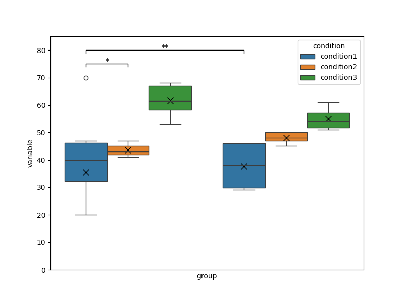
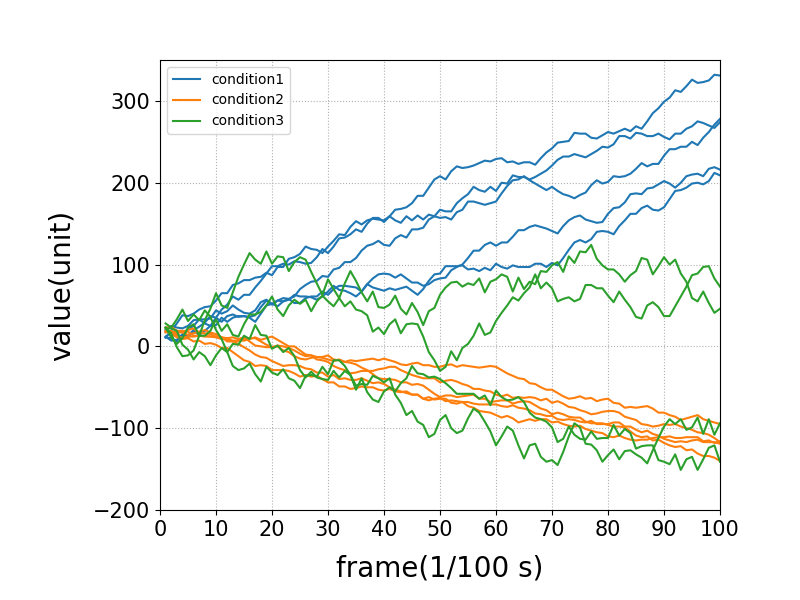
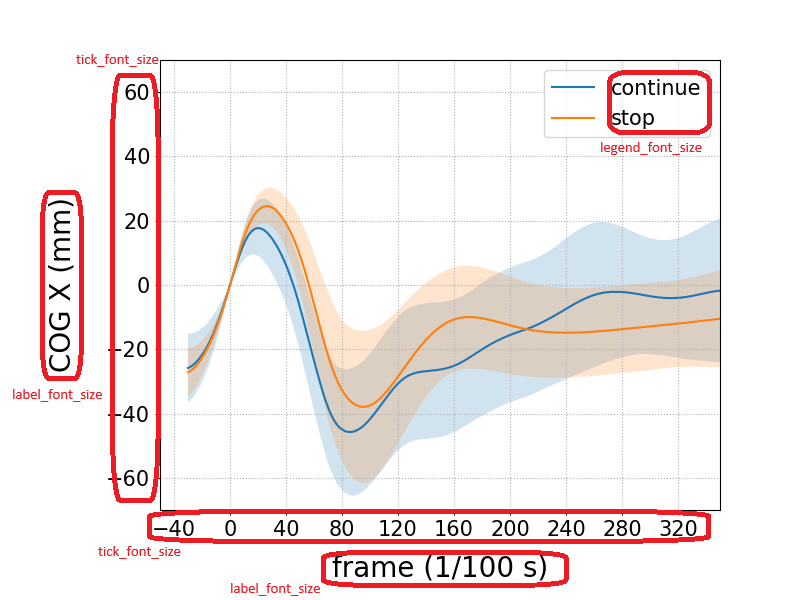
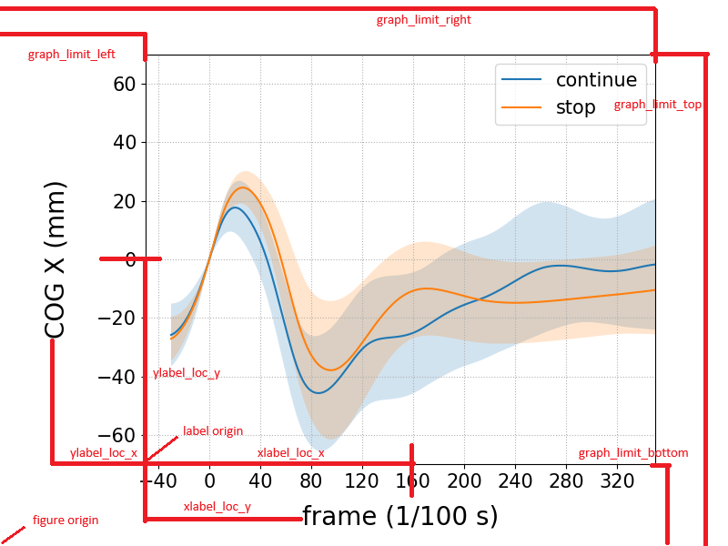

# trplots

## 概要

* 規程形式の入力データをグラフ(箱ひげ図or線グラフ)化する
* (option) データの概要を出力する

<details open>

<summary>生成グラフ例</summary>





</details>

## 環境 (動作確認済み)

* Python 3.12.2
    * WindowsでPythonランチャーを使用していることを前提としている
        * それ以外の場合pyコマンドを適宜pythonコマンド等に置き換えること
    * ライブラリはetc/requirements.txtを参照
* PowerShell 7.4.6

## How to use

### 準備

1. このリポジトリをクローンまたは最新リリースのzipファイルをダウンロードする
1. init.ps1を実行する

```powershell
./init.ps1
```

### 実行

1. Input/に指示ファイル，データファイルを配置する(詳細は以下)
1. config.ymlを編集する
1. run.ps1を実行する

```powershell
./run.ps1
```

## ファイル構成

```plaintext
DataVisualize/
│  .gitignore
│  config.yml
│  init.ps1
|  run.ps1
│
├─docs
│  │  CHANGELOG.md
│  │  LICENSE
│  │  README.md
│  │
│  └─img
│          fonts.png
│          locs.png
│          single_ex.png
│          single_ex_description.png
│          ts_ex.png
│          ts_ex_individual.png
│
├─etc
│      config.yml-template
│      instructions.csv-template
│      requirements.txt
│
├─Inputs
├─Inputs-example
│      instructions-example.csv
│      single-example.csv
│      time_series-example.csv
│
├─Outputs
└─src
        gen_graph.py
        graph.py
```

## 入力

* 以下の通り1つの指示ファイルと1つ以上のデータファイル，config.ymlを用意する

### 指示ファイル

Input/にinstructions.csvを配置し，以下の通り記述する．
なお2列目以降は例であるため，実際のデータに合わせて変更する．
先頭のスペースは無視される．
**指示ファイルの形式が間違っている場合のエラー処理等は実装していないので注意**

```csv

output_name, filename, dtype, graph_type, xlim_min, xlim_max, ylim_min, ylim_max, xlabel, ylabel, legend, brackets, bracket_base_y
output1, data1.csv, wide, box, , , 20, 50, condition, parameter1, condition1:con1.condition2:con2.condition3:con3, [1:1][1:2]*.[1:1][2:1]**, 70
output2, data2.csv, long, line, 0, 100, -10, 200, frame, parameter2, True:continue.False:stop.:PGT, ,

```

| output_name | filename  | dtype | graph_type | xlim_min | xlim_max | ylim_min | ylim_max | xlabel    | ylabel     | legend                                          | brackets                 | bracket_base_y |
| ----------- | --------- | ----- | ---------- | -------- | -------- | -------- | -------- | --------- | ---------- | ----------------------------------------------- | ------------------------ |
| output1     | data1.csv | wide  | box        |          |          | 20       | 50       | condition | parameter1 | condition1:con1.condition2:con2.condition3:con3 | [1:1][1:2]*.[1:1][2:1]** | 70             |
| output2     | data2.csv | tp    | line       | 0        | 100      | -10      | 200      | frame     | parameter2 | True:continue.False:stop.:PGT                   |                          |                |

このとき各列の指定方法は以下の通り

1. output_name: 出力ファイル名(**必須**，拡張子なし，png形式等で出力，ディレクトリ指定可能)
1. filename: データファイル名(**必須**，拡張子あり，csv形式，visualize/Input/をルートとした相対パスで指定)
1. dtype: データ形式(wide: ワイド形式，tp: 転置形式): [入力データ形式](### 入力データファイル形式)参照 (**必須**)
1. graph_type: グラフの種類(box: 箱ひげ図，line: 折れ線グラフ) (**必須**)
1. xlim_min: x軸の最小値 (graph_typeがlineの場合のみ有効)
    * minとmaxが同時に指定されていない場合は適用されない(以下min, max系は同様)
1. xlim_max: x軸の最大値 (graph_typeがlineの場合のみ有効)
1. ylim_min: y軸の最小値
1. ylim_max: y軸の最大値
    * bracket_base_yよりも大きい値を指定することを推奨
1. xlabel: x軸のラベル，$$で囲むことでLaTex数式記法使用可能 (**必須**)
1. ylabel: y軸のラベル，$$で囲むことでLaTex数式記法使用可能 (**必須**)
1. legend: 入力csvの列名と凡例の対応表(コロンで対応，ピリオドで区切り)
    * ここで指定した凡例の順番でグラフに表示される
    * 例: Trueをcontinue，Falseをstop，空文字をPGTというラベルにしたい場合: True:continue.False:stop.:PGT
    * **注意**: データファイルの列名でTRUE/FALSEを使用している場合，True/Falseとして認識されるので注意
        * Bool型で読み取られた後に文字列に変換されるため
    * **注意**: 変換前のcondition名すべてに対応した凡例を指定する必要がある
    * **注意**: 凡例中にピリオドを含む場合には対応していない
1. brackets: 有意差の対応表(ピリオド区切りで複数指定可能)
    * 指定した順に下から追加される
    * 有意差を示すブラケットの形式は`[group_id:condition_id][group_id:condition_id]mark`のように指定する
        * ここで各要素の意味は以下の通り
            * group_id: groupの番号(数字，1始まり)
            * condition_id: conditionの番号(数字，1始まり)
            * mark: ブラケット上部に表示する文字
        * このように指定すると，1つ目の[]で指定した条件と2つ目の[]で指定した条件の間に有意差を示すブラケットが表示される
    * 例: `[1:1][1:2]*.[1:1][2:1]**` は以下の通り
        1. `[1:1][1:2]*` : 1つ目のgroupの1番目のconditionと1つ目のgroupの2番目のconditionの間に`*`で有意差ブラケットを表示
        1. `[1:1][2:1]**` : 1つ目のgroupの1番目のconditionと2つ目のgroupの1番目のconditionの間に`**`で有意差ブラケットを表示
1. bracket_base_y: 箱ひげ図の有意差を示す線の最低y座標
    * データの最大値より大きい値を指定することを推奨

exampleファイル，brackets系は[参考画像](img/single_ex_description.png)も参照のこと

### 入力データファイル形式

* 対応形式は[schemeta_splitter](https://github.com/sakashita44/schemeta_splitter?tab=readme-ov-file#%E5%AF%BE%E5%BF%9C%E3%83%95%E3%82%A1%E3%82%A4%E3%83%AB%E5%BD%A2%E5%BC%8F)の対応ファイル形式に準拠する(行/列名は自由だが，メタデータ部分の列/行数は固定)．
* gen_graph.pyでは列番号指定でデータをグラフ化するため，列が異なる場合は正しいグラフが出力されない．

#### ワイド形式 (wide)

* instructions.csvのdtypeに"wide"を指定する
* 形式: csv
* メタデータ部分の列数は4列(uid, main_id, sub_id, group)，データ部分の列数は1列以上
    * メタデータの各列の意味
        * uid: ユニークID (ファイル内で一意のIDとして扱う)
        * main_id: メインID (被験者番号等)
        * sub_id: サブID (試行番号等)
        * group: グループ (比較条件等: (例: 介入群Aと対照群B等))
    * データ部分
        * graph_typeでboxを指定した場合: データ部分の1列目のみが使用される
        * graph_typeでlineを指定した場合: データ部分の列名がx軸，各列の値がy軸として使用される
        * いずれの場合も各行が1つのデータとして扱われる

例: uid, main_id, sub_id, groupがメタデータ部分，data1, data2, data3がデータ部分の列名

```csv

uid, main_id, sub_id, group, data1, data2, data3, ...
1, X, 1, A, 10, 20, 30, ...
2, X, 2, A, 20, 30, 40, ...
3, X, 3, B, 30, 40, 50, ...
4, X, 4, B, 40, 50, 60, ...
5, Y, 1, A, 50, 60, 70, ...
6, Y, 2, A, 60, 70, 80, ...
7, Y, 3, B, 70, 80, 90, ...
8, Y, 4, B, 80, 90, 100, ...
...

```

#### 転置形式 (tp)

* instructions.csvのdtypeに"tp"を指定する
* 形式: csv
* ワイド形式の転置形式

例

```csv

uid, 1, 2, 3, 4, 5, 6, 7, 8, ...
main_id, X, X, X, X, Y, Y, Y, Y, ...
sub_id, 1, 2, 3, 4, 1, 2, 3, 4, ...
group, A, A, B, B, A, A, B, B, ...
data1, 10, 20, 30, 40, 50, 60, 70, 80, ...
data2, 20, 30, 40, 50, 60, 70, 80, 90, ...
data3, 30, 40, 50, 60, 70, 80, 90, 100, ...
...

```

### config.yml

* グラフ出力等に関する設定を記述する
* visualize/に配置する
* 詳細はconfig.yml-templateや参考画像を参照

<details>
<summary>設定参考画像</summary>



</details>

## 出力

* Output/にグラフが出力される
* config.ymlでグラフ出力に関する設定を変更可能
